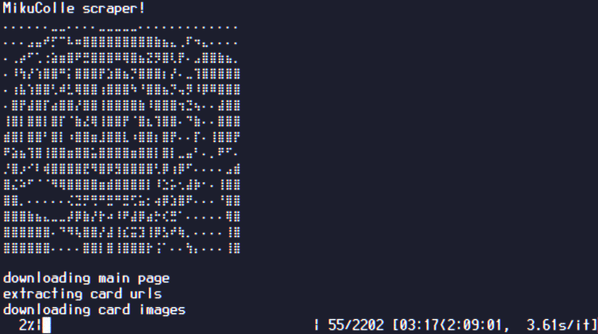

# mikucolle-scrape

a simple scraper to download all card images from https://mikucolle.gamerch.com/



## Usage

- Install requirements from requirements.txt: ```pip install -r requirements.txt```
- Run main.py: ```python main.py```

